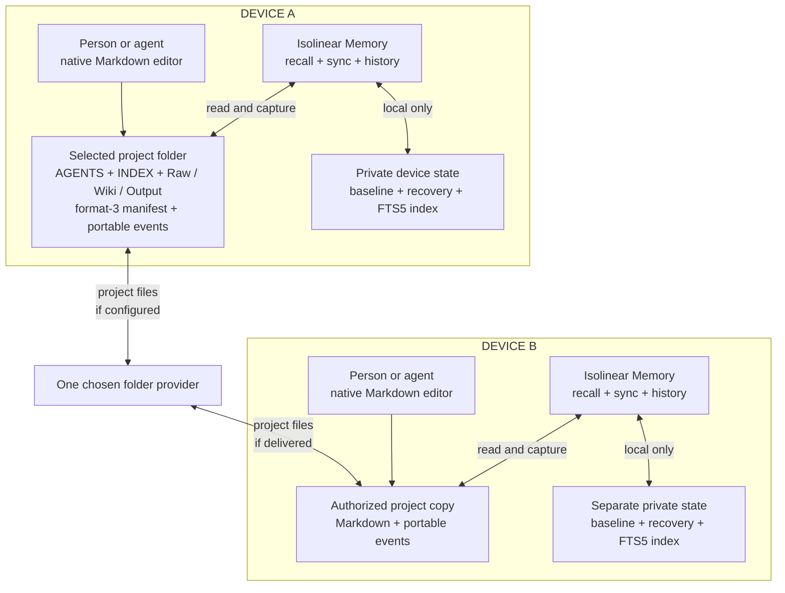
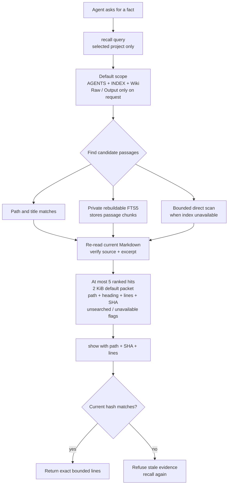
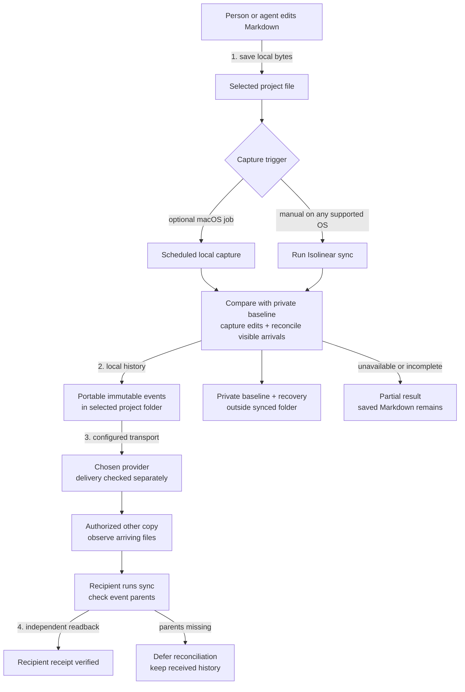
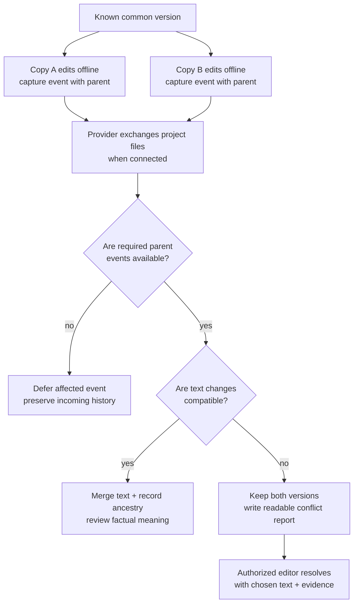
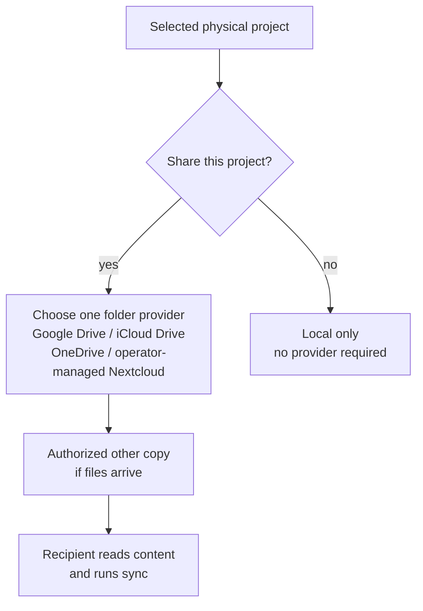

# Isolinear Memory

<p align="center">
<picture>
  <source media="(prefers-color-scheme: dark)" srcset="assets/isolinear-memory-dark.png">
  
</picture>
</p>

**Persistent Markdown memory for people and AI agents. Edit notes normally; retrieve only the evidence a task needs.**

Isolinear Memory 0.5.1 works inside one selected folder. Markdown remains the source
of truth. The runtime records recoverable change history, reconciles the project
files visible on each device, and returns small, source-linked passages to agents.
Obsidian is optional. No memory-extraction model, vector service, MCP server or
hosted account is required.

The name is inspired by [Star Trek's isolinear chips](https://www.startrek.com/en-un/news/below-deck-with-lower-decks-403-move-along).
[Explore the artwork](assets/README.md).

## What lives where

| Layer | Contents | Role |
| --- | --- | --- |
| Selected project folder | `AGENTS.md`, `INDEX.md`, Markdown in `Raw/`, `Wiki/` and `Output/`, the format-3 manifest and portable event history | Canonical notes and history that the chosen folder provider can transport. Existing projects keep their own layout. |
| Private state on each device | Causal baseline, recovery material and a rebuildable SQLite FTS5 index containing passage text | Speeds recall and supports safe local capture. It stays outside synchronized storage and is never a second authority. |
| Folder provider, if chosen | Copies of the selected project files | Transports files between authorized devices. Isolinear Memory does not create access grants or prove delivery. |
| Agent context | Bounded excerpts with paths, line numbers and source hashes | Holds just the evidence needed for the current task. Expand an exact source only when needed. |

Each device has its own private state, even when people work on copies of the same
project. Selecting a subfolder inside a larger vault does not include its parent
notes or nested projects. The diagram shows that boundary:

<!-- BEGIN GENERATED MERMAID: 01-shared-folder.mmd -->

<!-- END GENERATED MERMAID: 01-shared-folder.mmd -->

Isolinear Memory reads and records only the selected project folder. Configure
the provider's own sync scope and permissions separately; it may also sync
other folders. The private baseline, FTS5 index, credentials and recovery state
have no project-provider arrow. A local-only project needs no provider at all.

## Find relevant memory with a small context packet

Start with `AGENTS.md` and `INDEX.md`, then follow their routes to the relevant
Wiki note. Native file search and editing remain first-class tools. When the
location is unknown, `recall` searches the selected project and returns a compact
packet: at most **five ranked hits** and **2 KiB by default**. Each hit carries a
vault-relative path, heading, line range, exact excerpt and SHA-256 source hash.
The result also says when sources were unavailable, truncated or left unsearched.

By default, recall considers root `AGENTS.md` and `INDEX.md` plus `Wiki/`.
`Raw/` and `Output/` are opt-in. A private FTS5 index stores rebuildable note
passages to accelerate lookup. Path and title matches can avoid a broad content
scan; if indexing is unavailable or incomplete, recall has a bounded direct
Markdown fallback. Returned hits are checked against current file bytes. A
cached hit can still leave newer, nonmatching files unsearched, so use
`--refresh` or a targeted native search when completeness matters. Reads have
a five-second outer deadline and report partial coverage instead of silently
claiming an exhaustive search.

<!-- BEGIN GENERATED MERMAID: 05-recall-and-index.mmd -->

<!-- END GENERATED MERMAID: 05-recall-and-index.mmd -->

For example:

```bash
isolinear-memory recall "/path/to/project" "current project owner" --text
isolinear-memory show "/path/to/project" \
  --path "Wiki/Project Brief.md" \
  --sha256 HASH_FROM_RECALL --start 22 --end 28 --text
```

`show` expands up to 80 exact lines (8 KiB default) and refuses to quote a
file whose hash changed since recall. Search again after a stale result. The
CLI also offers a versioned JSON envelope for integrations; `--text` gives
agents a concise plain-text view.

## Remember useful work automatically

An agent with access to the selected folder reads its short `AGENTS.md` and
`INDEX.md`, does the requested work, then updates the relevant canonical Wiki
note without a separate “remember this” prompt. It records durable findings,
decisions, artifact links, current status and next steps with their sources and
uncertainty. Substantial generated files belong in `Output/`; their Wiki note
links the result. The agent reads back its edits before finishing. Routine
intermediate steps and conversation transcripts do not need separate notes.

The agent performs this knowledge write through native file tools. New projects
receive this rule in their seeded `AGENTS.md`; existing projects keep their own
instructions and can adopt the rule through a targeted edit. Isolinear
Memory captures the resulting file changes locally; it does not watch a chat or
use another model to decide what is important. A healthy macOS capture job runs
outside the agent, while the agent can run one bounded sync when no job is
available. Normal success needs at most a short saved-location confirmation.
Capture diagnostics and provider state stay in the background unless they affect
the current result, a requested delivery check or an action the person must take.

## Save normally, then capture history

People and agents edit ordinary Markdown directly. A file save persists bytes
locally. `sync` compares observed files with the device's private causal
baseline, records immutable events in the selected project, and reconciles
history already visible from the provider. The optional **macOS local capture
job** can run this work outside the model. Without that job, the agent runs one
bounded manual sync after material edits and provider arrivals.

```bash
isolinear-memory sync "/path/to/project" --brief
```

For long registers, `append-row` adds one validated row atomically without an
agent loading the entire table into context. It is a local Markdown edit, so
capture still follows it:

```bash
isolinear-memory append-row "/path/to/project" \
  --path "Wiki/Change Register.md" --heading "Change Register" \
  --row "| 2026-09-29 | Verified decision |"
```

The table must already exist and the row must match its columns. Native
targeted edits remain appropriate for ordinary notes.

<!-- BEGIN GENERATED MERMAID: 02-edit-and-deliver.mmd -->

<!-- END GENERATED MERMAID: 02-edit-and-deliver.mmd -->

These are four separate observations:

| State | What it establishes |
| --- | --- |
| Markdown saved | Local file bytes were written. |
| History captured | A local event and private baseline record the observed version. |
| Provider delivery | A configured provider transported files to another copy. This needs provider-side evidence. |
| Recipient receipt | The other device read the intended content and history, then reconciled them. This needs independent readback. |

A partial or failed capture does not discard saved Markdown. It reports
unavailable files, missing history or other incomplete work. A configured
capture job does not imply a successful run; inspect its latest result. A
provider can overwrite a version before local capture records it, so retain
provider history or backups for uncaptured work.

## Work offline and preserve disagreements

Two copies can edit while disconnected. Each captured event records its known
parent versions; timestamps do not select a winner. Once the provider delivers
complete parent history, compatible text edits can merge. Missing parents
defer reconciliation. Overlapping edits or ambiguous ancestry keep both
versions and a readable conflict report until an authorized editor resolves
the difference with chosen text and evidence.

<!-- BEGIN GENERATED MERMAID: 03-offline-and-conflicts.mmd -->

<!-- END GENERATED MERMAID: 03-offline-and-conflicts.mmd -->

Text convergence does not prove factual agreement. Review consequential claims
against their sources. A missing provider file is not an intentional deletion:
`delete` and `rename` record those decisions explicitly. A rename does not
rewrite Markdown or Obsidian backlinks automatically.

## Choose local-only use or one provider

A single physical project can stay local or use **one** configured folder
provider. Google Drive, iCloud Drive, OneDrive and operator-managed Nextcloud
are alternative routes, not bridges between services. Another person needs
provider access to the selected folder and a separate local setup; neither
folder selection nor a successful local sync grants access or proves receipt.

<!-- BEGIN GENERATED MERMAID: 04-provider-options.mmd -->

<!-- END GENERATED MERMAID: 04-provider-options.mmd -->

Provider behavior depends on the account, OS client, offline availability
and conflict handling. Check actual delivery on each recipient device. See
[provider guidance](docs/PROVIDERS.md) for the operating details.

## Install or update

1. Download the [v0.5.1 release](https://github.com/Kian-hdr/isolinear-memory/releases/tag/v0.5.1) and verify the runtime against its external `SHA256SUMS`.
2. [Give the setup prompt](SETUP-PROMPT.md) to an agent with local file access, or follow the [installation guide](docs/INSTALL.md).
3. Select the intended folder. A wholly empty folder can receive `Raw/`, `Wiki/`, `Output/`, `AGENTS.md` and `INDEX.md`. A populated folder retains its hierarchy, instructions and attachments; add the memory rule to its existing agent instructions when appropriate.
4. Have the agent confirm the installed version, make one small edit, and verify local history capture. For requested sharing, it checks provider and recipient delivery separately.

The runtime requires Python 3.11 or newer. The verified `.pyz` works on macOS,
Linux and Windows. The stable POSIX launcher is available on macOS/Linux;
Windows runs the package with Python directly. This release supplies an
optional automatic capture installer for macOS. Linux and Windows can use
manual sync or an independently configured host scheduler.

Existing format-3 projects keep their project IDs, history and private
bindings. The `shared-memory` command and setup skill remain compatibility
entry points. The manifest `.shared-memory.json`, portable
`.shared-memory/` history and internal `shared_workspace` module retain their
protocol names; adopting Isolinear Memory does not require a folder migration.
Formats 1 and 2 use their historical coordinator workflow until an explicit,
backed-up migration. See the [brand transition](docs/BRAND-MIGRATION.md) and
[operating guide](docs/PRODUCT-V1.md).

## Validation and limits

Release assets are built from one clean source commit and checked by the
[macOS, Linux and Windows CI matrix](https://github.com/Kian-hdr/isolinear-memory/actions).
Each release includes SHA-256 checksums and a source manifest. The
[synthetic benchmarks](benchmarks/README.md) and
[agent compatibility evidence](docs/AGENT-COMPATIBILITY.md) distinguish
measured task results from interface compatibility.

Shared history can retain earlier note content, including text later removed
from the current Markdown. Path rules and filename filters are not a secret
classifier: select the right folder and keep credentials and private state
outside it. Provider permissions and read-only bindings remain the access
boundary. [Validation detail](VALIDATION.md) distinguishes local tests from
provider and independent-device checks.

## License

[MIT](LICENSE). The [historical coordinator workflow](docs/COORDINATOR-WORKFLOW.md)
remains available for projects that use it.
