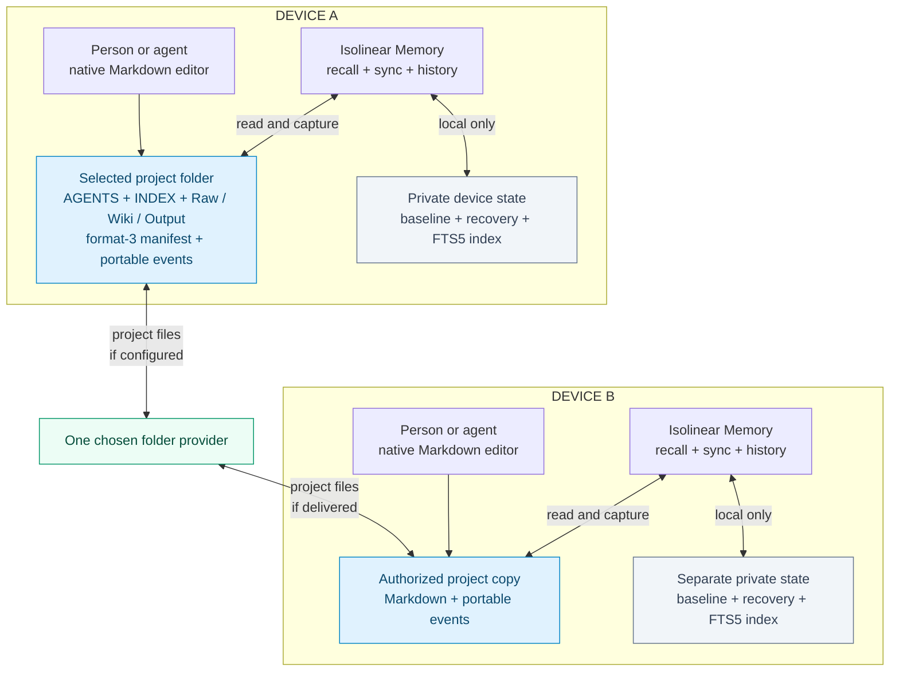
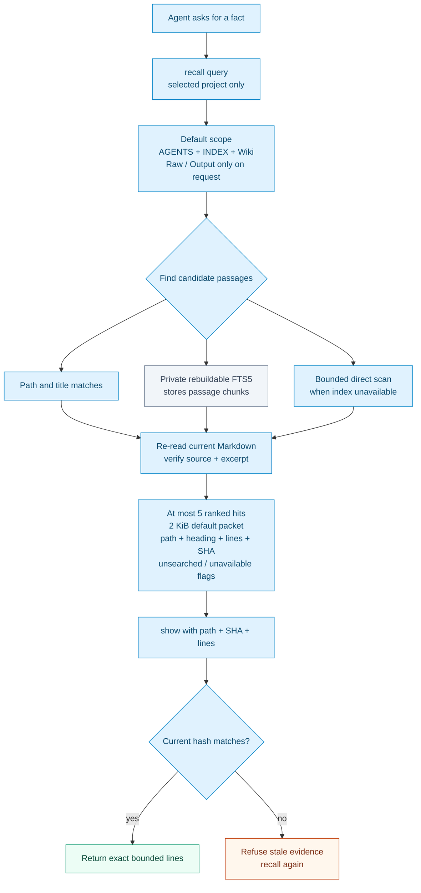
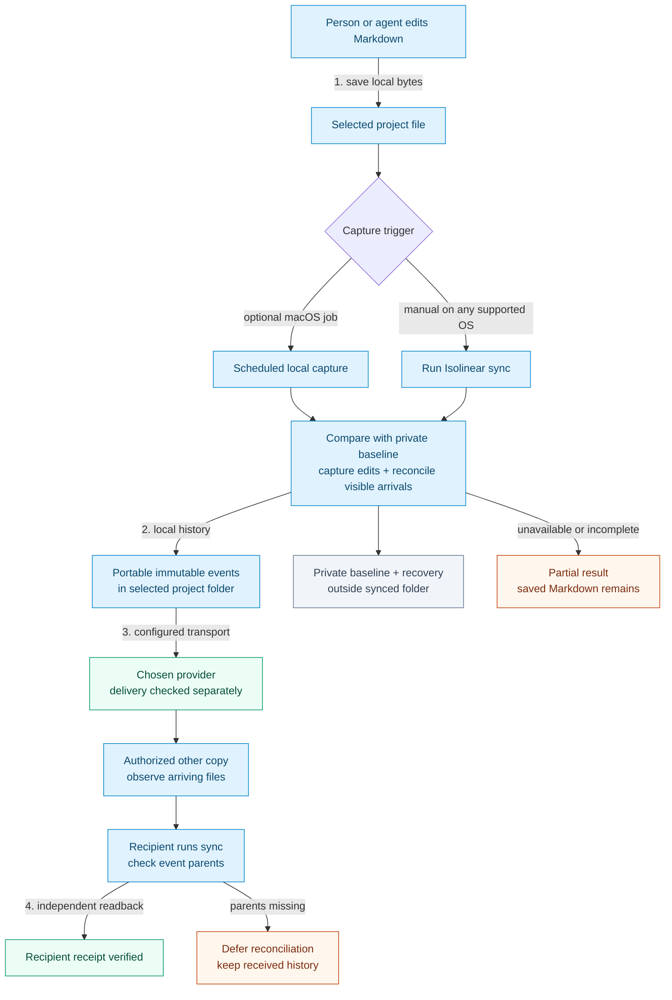
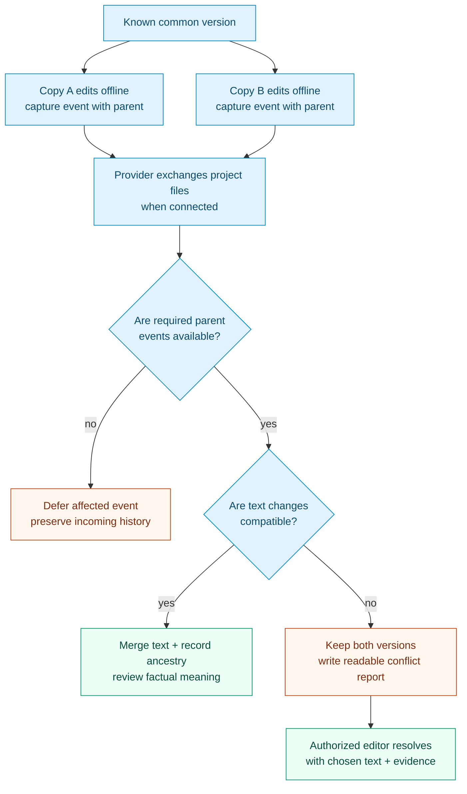
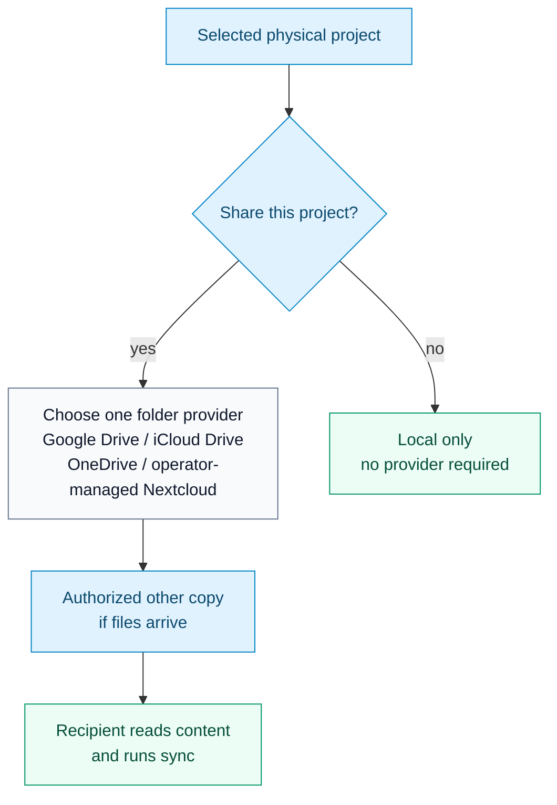

# Isolinear Memory system diagrams

These diagrams describe the **0.5.1 format-3 folder workflow**. They
separate note storage, private indexing, local history capture, provider
transport and recipient verification. The older format-1/2 coordinator has a
[separate operating guide](COORDINATOR-WORKFLOW.md).

The editable `.mmd` files under `assets/diagrams/` are the source of truth.
Each diagram below is generated from one of those files, as are the matching
SVG fallbacks. The [README](../README.md) uses the same sources with native
GitHub colors. Change a source file, regenerate both Markdown documents and
SVGs, then inspect the rendered figures. The product runtime does not depend
on Mermaid, Node or Chrome.

## 1. Portable project and private device state

<!-- BEGIN GENERATED MERMAID: 01-shared-folder.mmd -->

<!-- END GENERATED MERMAID: 01-shared-folder.mmd -->

<details>
<summary>SVG fallback</summary>



</details>

[Editable Mermaid source](../assets/diagrams/01-shared-folder.mmd)

The selected folder contains canonical Markdown, the format-3 manifest and
portable immutable events. Isolinear Memory reads and records that folder;
the provider's own sync scope and access permissions are configured separately.
Each device's private baseline, recovery material
and FTS5 database remain outside the shared folder. The private index contains
rebuildable passage text for faster retrieval; it never decides which note is
authoritative. A parent Obsidian vault and nested projects stay outside the
selected project's boundary.

## 2. Bounded recall and hash-checked expansion

<!-- BEGIN GENERATED MERMAID: 05-recall-and-index.mmd -->

<!-- END GENERATED MERMAID: 05-recall-and-index.mmd -->

<details>
<summary>SVG fallback</summary>



</details>

[Editable Mermaid source](../assets/diagrams/05-recall-and-index.mmd)

`recall` searches root `AGENTS.md` and `INDEX.md` plus `Wiki/` by default.
`Raw/` and `Output/` require explicit inclusion. Path and title matches,
private FTS5 chunks and bounded direct scans supply candidate passages.
The runtime rechecks current Markdown before returning at most five hits
inside a 2 KiB default packet. Each hit carries a source path, heading, line
span, exact excerpt and source hash. The packet reports unavailable,
truncated and unsearched material. A warm cached hit may not discover a new
nonmatching file until refresh; use `--refresh` or native targeted search
when the coverage flag matters. `show` expands up to 80 lines only if the
current source hash still matches. A changed file produces a stale-evidence
refusal instead of an old quote.

## 3. Save, capture, transport and verify

<!-- BEGIN GENERATED MERMAID: 02-edit-and-deliver.mmd -->

<!-- END GENERATED MERMAID: 02-edit-and-deliver.mmd -->

<details>
<summary>SVG fallback</summary>



</details>

[Editable Mermaid source](../assets/diagrams/02-edit-and-deliver.mmd)

An editor or agent saves Markdown directly. Manual `sync` on any supported OS,
or an optional macOS capture job, compares observed bytes with the private
causal baseline. It records local events before reconciling history already
visible from the provider. Event files are portable; the baseline is not.
The provider transports selected project files separately. A recipient
must actually observe the intended files and run `sync` before independent
receipt can be asserted. Missing source bytes, invalid events or missing
parents remain explicit partial/deferred states. A partial capture preserves
the saved note and its private recovery state.

| State | Evidence needed |
| --- | --- |
| Local save | Read back the file on this device. |
| Local capture | Verify the new history event and private baseline. |
| Provider delivery | Inspect the provider's actual transfer state. |
| Recipient receipt | Read the intended content and history on the other device. |

## 4. Offline ancestry and conflicts

<!-- BEGIN GENERATED MERMAID: 03-offline-and-conflicts.mmd -->

<!-- END GENERATED MERMAID: 03-offline-and-conflicts.mmd -->

<details>
<summary>SVG fallback</summary>



</details>

[Editable Mermaid source](../assets/diagrams/03-offline-and-conflicts.mmd)

Both copies can descend from one known version. Capture records each change
with its parent rather than selecting a winner by wall-clock time. If a parent
event has not arrived, reconciliation of the affected event waits. With
complete ancestry, compatible text can merge; overlapping or ambiguous
changes retain both versions and a readable conflict report. An authorized
editor supplies chosen text and evidence to resolve a conflict. A clean text
merge is still only text convergence, not factual agreement.

Missing files alone never mean intentional deletion. `delete` and `rename`
record explicit intent; rename does not automatically repair Markdown or
Obsidian backlinks. Read-only bindings and provider permissions remain in
force.

## 5. Local-only use and provider choice

<!-- BEGIN GENERATED MERMAID: 04-provider-options.mmd -->

<!-- END GENERATED MERMAID: 04-provider-options.mmd -->

<details>
<summary>SVG fallback</summary>



</details>

[Editable Mermaid source](../assets/diagrams/04-provider-options.mmd)

A project needs no provider for local-only use. For sharing, choose one
provider for each physical folder: Google Drive, iCloud Drive, OneDrive or an
operator-managed Nextcloud service. These are alternatives, not bridges.
Account permissions, desktop-client behavior, offline availability and
conflict copies vary by setup. The provider must be configured separately;
Isolinear Memory does not provision it or grant another person access.
See [provider guidance](PROVIDERS.md). Recipient readback is the final
acceptance check for delivery.

## Regenerate and inspect

The standard-library checker compares all generated Mermaid blocks in both
the README and this guide against the `.mmd` sources:

```bash
python3 scripts/render_diagrams.py --check-markdown
python3 scripts/render_diagrams.py --update-markdown
```

The checker does not validate SVG freshness. To render SVGs and optional PNG
previews, use pinned Mermaid CLI **11.17.0**, Node.js and an existing
Chrome/Chromium executable. Install development-only tooling outside the
repository:

```bash
PUPPETEER_SKIP_DOWNLOAD=true npm install \
  --prefix /tmp/isolinear-memory-diagram-tools \
  --no-save --ignore-scripts --no-audit --no-fund \
  @mermaid-js/mermaid-cli@11.17.0

python3 scripts/render_diagrams.py \
  --mmdc /tmp/isolinear-memory-diagram-tools/node_modules/.bin/mmdc \
  --chrome "/path/to/Chrome-or-Chromium" \
  --png-dir /tmp/isolinear-memory-diagram-previews
```

The renderer processes every `.mmd` source, writes corresponding SVGs,
optionally creates PNG previews outside the repository and updates both
Markdown documents. Inspect every figure for readable labels, clipping,
arrow direction, contrast and accurate privacy boundaries. The SVGs carry
Mermaid accessibility titles and descriptions; surrounding prose explains
the same relationships without relying on color.
